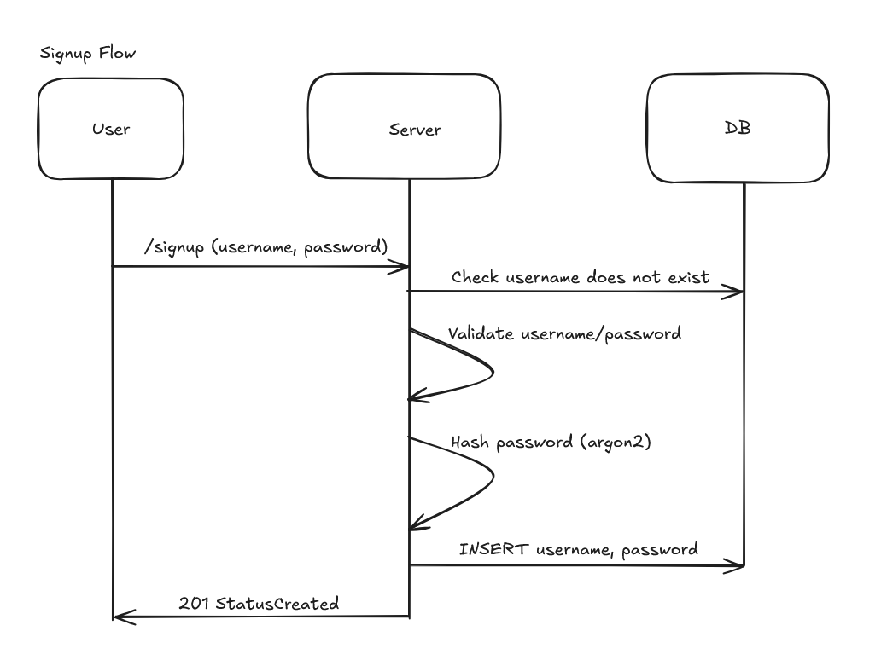
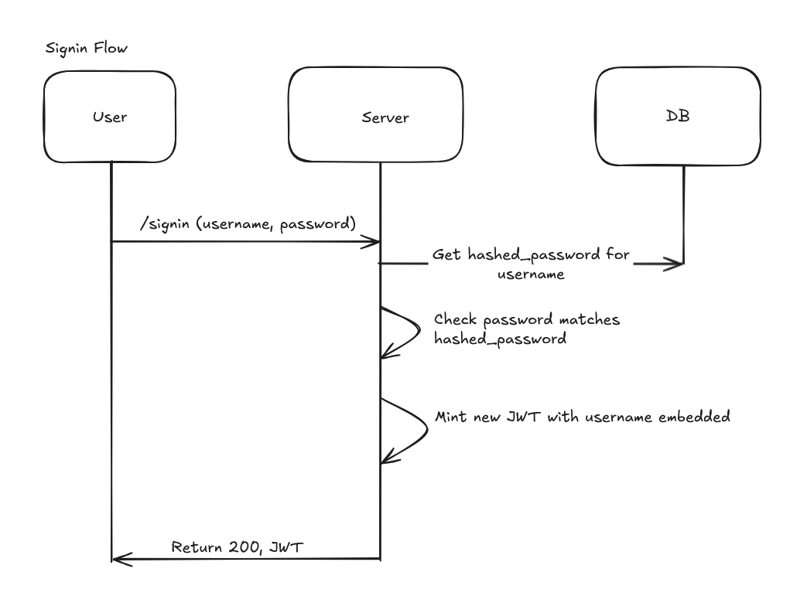

# open_discord

Discord without the privacy concerns, someday. It's really just an IRC client right now. If we can get voip
working someday, then we'd really be cooking.

## Overview

open_discord is intended to be self-hosted rather than centralized. Each server is a completely separate
instance, so a user's username/password on `Server A` is completely separate from `Server B`.

At the moment, all users in a server have access to all rooms in that server.

## Feature plans

- ~~Room Ordering~~
- Username color customization
- Room Categories
- Configurable nicknames
- Server commands
  - For example, to configure nicknames
- User roles
  - Only users with certain roles can see certain channels
  - Only users with certain roles can create new channels
- Threads
  - Slack-style
- VOIP
- Images uploads
- Data retention policies
  - Automatically clean up data older than some configured timeframe
- Rate Limiting
- User Presence
  - Use Redis to display whether a user is actively connected or not

## Implementation Plans

- Refactor rooms to each be run in its own goroutine
- Rework `message` table to be scoped to any and all `RoomEvents`
- 

## Auth

The whole point of this project is to avoid interacting with giant companies that don't care about user privacy
(and coincidentally provide oauth services) so we're rolling our own username/password based verification.

2FA would be cool to implement, at some point.

### Signup

### Login

After the user is logged in, they will send their JWT to all subsequent API requests.
We will use the username embedded in the JWT to determine which user sent the API request.

To prevent users from needing to re-login once the JWT expires, eventually we'll want to implement
refresh tokens.

## A Note on AI Usage

The backend was coded entirely by hand by me, https://github.com/leestran1995. That being said, GoLand's
autocomplete is really good, so a lot of the `if err != nil { return err }` checks were just tabbed through, but I'll
be dead in a ditch before I cheat on a portfolio project.

The frontend was coded
by https://github.com/vrennat by way of Claude.
