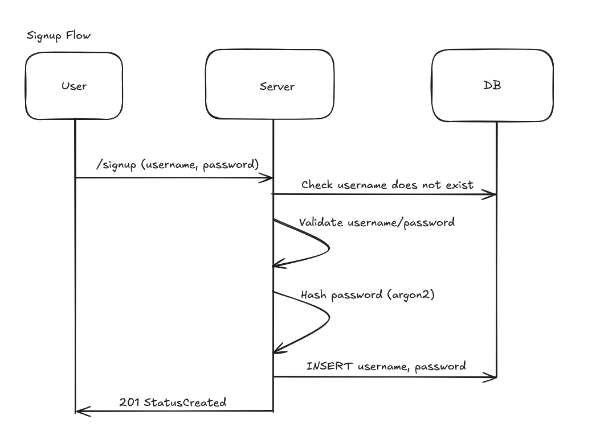
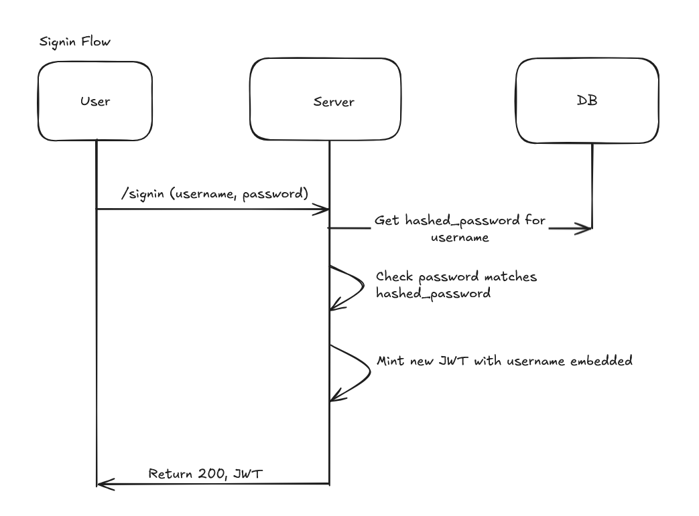

# open_discord

Discord without the privacy concerns, someday. It's really just an IRC client right now. If we can get voip
working someday, then we'd really be cooking.

## Overview

open_discord is intended to be self-hosted rather than centralized. Each server is a completely separate
instance, so a user's username/password on `Server A` is completely separate from `Server B`.

## Initial Setup And Running

1. Spin up a postgresql server
2. Fill in placeholder values in `local.env.sample` and then rename it to `local.env`
3. Start the backend by running `go run ./internal/main/main.go`
4. Start the frontend by running `bun run dev` while in the `frontend` subdirectory

### DB Migrations

The DB migrations are tracked in the `migrations` directory, and can be run
by using [golang-migrate](https://github.com/golang-migrate/migrate). After installing golang-migrate,
simply run `migrate -source file://migrations -database [YOUR_DB_URL] up`

## Feature plans

- Username color customization
- Room Categories
- Configurable nicknames
- Server commands
  - For example, to configure nicknames
- User roles
  - Only users with certain roles can see certain channels
  - Only users with certain roles can create new channels
  - If a user does not have the role, they will receive ServerEvents with a type of [REDACTED] to maintain the auto-inc sequence
- Threads
  - Slack-style
- VOIP
- Images uploads
- Data retention policies
  - Automatically clean up data older than some configured timeframe
- Rate Limiting
- User Presence
  - Use Redis to display whether a user is actively connected or not

## CLI

Once the backend is finished spinning up it will go into CLI mode, which offers numerous
functions for server administration. Notably, on a completely fresh server start, you will
need to use the CLI to mint an OTC for your first (likely admin) user, and then you will
need to use the CLI to make that user an admin. At the point, that admin user could use
standard REST endpoints for server administration (that don't exist at the time I'm writing this).

### CLI commands

- `otc`: Generates an OTC for server signups
- `role make <role_name>`: Creates a new role 
- `role delete <role_name>`: Deletes a role
- `role ls` or `role list`: Lists all roles
- `ur assign <role_name>`: Assigns a role to a user (ur stands for "user role")
- `ur remove <role_name>`: Unassigns a role from a user
- `ur ls <username>` or `ur list <username>`: lists roles assigned to <username>
-  `assignroomrole <room_name> <role_name>`: Assigns the room to the role
- `removeroomrole <room_name> <role_name>`: Unassigns role from room

## Auth

The whole point of this project is to avoid interacting with giant companies that don't care about user privacy
(and coincidentally provide oauth services) so we're rolling our own username/password based verification.

A user needs an OTC (One-Time-Code) in order to signup. This OTC must first be minted
by a server admin. In the future, it would be neat for the OTC to come in the form
of an invite URL, with the FE automatically passing it to the BE without the user
needing to copy and past eit.

2FA would be cool to implement, at some point.

### Signup

### Login

After the user is logged in, they will send their JWT to all subsequent API requests.
We will use the username embedded in the JWT to determine which user sent the API request.

To prevent users from needing to re-login once the JWT expires, eventually we'll want to implement
refresh tokens.

## A Note on AI Usage

The backend was coded entirely by hand by me, https://github.com/leestran1995. That being said, GoLand's
autocomplete is really good, so a lot of the `if err != nil { return err }` checks were just tabbed through, but I'll
be dead in a ditch before I cheat on a portfolio project.

The frontend was coded
by https://github.com/vrennat by way of Claude.
